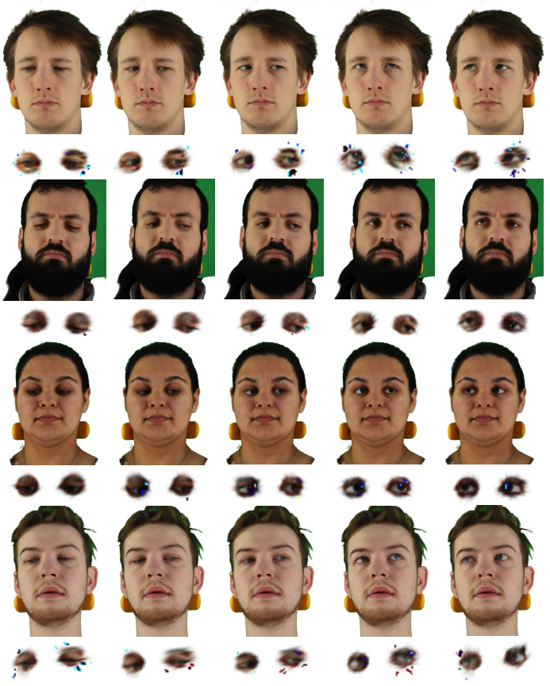

# Roll Your Eyes: Gaze Redirection via Explicit 3D Eyeball Rotation

 [[🍎 Project Page](https://rollyoureyes.github.io/RollyourEyes_ProjectPage/)] [[📖 arXiv Paper](https://arxiv.org/abs/2508.06136)] [[📁 Supplementary](assets/supplementary/supplementary.zip)] 

  <video width="320" height="240" controls>
    <source src="assets/supplementary/subject0016_gaze_redirection_res.mp4" type="video/mp4">
  </video>

  <video width="320" height="240" controls>
    <source src="assets/supplementary/subject0028_gaze_redirection_sep_res.mp4" type="video/mp4">
  </video>

## Code will be released soon