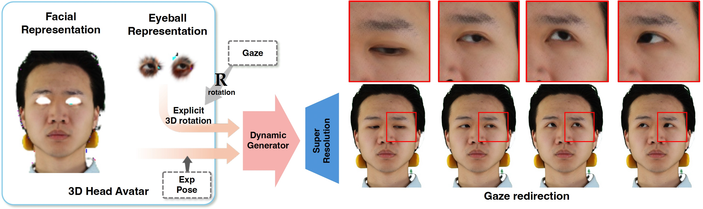
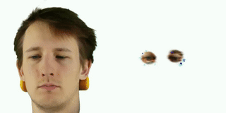

# Roll Your Eyes: Gaze Redirection via Explicit 3D Eyeball Rotation

[**YoungChan Choi**](),
[**Hengfei Wang**](https://hengfei-wang.github.io/),
[**YiHua Cheng**](https://www.yihua.zone/),
[**BoEun Kim**](https://aivlab.pages.dev/faculty),
[**Hyung Jin Chang**](https://hyungjinchang.wordpress.com/),
[**YoungGeun Choi**](),
[**Sang-Il Choi**](https://sites.google.com/view/mlpalab/about-us/supervisor?authuser=0),

 [[🍎 Project Page](https://rollyoureyes.github.io/RollyourEyes_ProjectPage/)] [[📖 arXiv Paper](https://arxiv.org/abs/2508.06136)] [[📁 Supplementary](assets/supplementary/supplementary.zip)] 

    

## Demo Videos

| Subject 0016 Gaze Redirection | Subject 0028 Gaze Redirection |
|:------------------------------:|:------------------------------:|
|  |  |

more demo videos are on supplementary

## Code will be released soon

